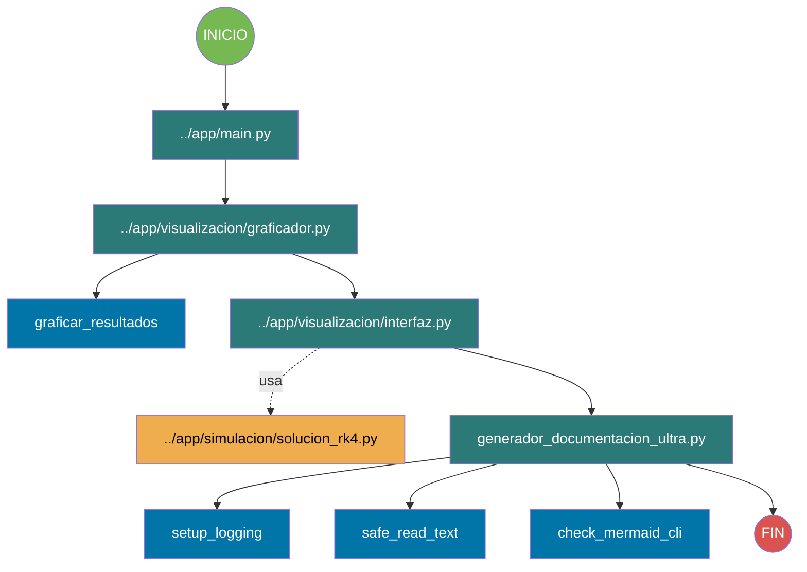

# Documentación ULTRA - 2025-11-24T13:21:23.252017

## Contenido

- Diagrama de arquitectura
- Diagrama de flujo
- Desglose de módulos

## Diagrama de Arquitectura

```mermaid
flowchart TD
    %% Arquitectura generada 2025-11-24T13:20:55.694600
    subgraph [""]
        mod_2315798485438020635(["generador_documentacion_ultra.py"]):::module
        mod_2315798485438020635_fn_8292411523267635985[setup_logging]:::function
        mod_2315798485438020635 --> mod_2315798485438020635_fn_8292411523267635985
        mod_2315798485438020635_fn_3472091639307335157[safe_read_text]:::function
        mod_2315798485438020635 --> mod_2315798485438020635_fn_3472091639307335157
        mod_2315798485438020635_fn_430844329840131648[check_mermaid_cli]:::function
        mod_2315798485438020635 --> mod_2315798485438020635_fn_430844329840131648
    end
    subgraph __/app["..\app"]
        mod_1939411522392776863(["main.py"]):::module
        mod_1315204223632259207(["__init__.py"]):::module
    end
    subgraph __/app/procesos_datos["..\app\procesos_datos"]
        mod_6738983060679552275(["ajuste_curvas.py"]):::module
        mod_6738983060679552275_fn_1973192060413426804[modelo_sinusoidal]:::function
        mod_6738983060679552275 --> mod_6738983060679552275_fn_1973192060413426804
        mod_6738983060679552275_fn_7022996169814790521[ajustar_sinusoidal]:::function
        mod_6738983060679552275 --> mod_6738983060679552275_fn_7022996169814790521
        mod_6738983060679552275_fn_4636501643793552315[generar_curva_ajustada]:::function
        mod_6738983060679552275 --> mod_6738983060679552275_fn_4636501643793552315
        mod_520555609333826913(["cargador_datos.py"]):::module
        mod_520555609333826913_fn_6966046822747654515[validar_dataframe]:::function
        mod_520555609333826913 --> mod_520555609333826913_fn_6966046822747654515
        mod_520555609333826913_fn_1075309044100812020[cargar_csv]:::function
        mod_520555609333826913 --> mod_520555609333826913_fn_1075309044100812020
        mod_520555609333826913_fn_2020719298092526985[generar_modelo_variable_por_defecto]:::function
        mod_520555609333826913 --> mod_520555609333826913_fn_2020719298092526985
        mod_3409462676890906962(["interpolacion.py"]):::module
        mod_3409462676890906962_fn_2762926256920447699[interpolacion_lineal]:::function
        mod_3409462676890906962 --> mod_3409462676890906962_fn_2762926256920447699
        mod_3409462676890906962_fn_140072749262395965[interpolacion_spline]:::function
        mod_3409462676890906962 --> mod_3409462676890906962_fn_140072749262395965
        mod_3409462676890906962_fn_5030016228623962915[temperatura_ambiente]:::function
        mod_3409462676890906962 --> mod_3409462676890906962_fn_5030016228623962915
        mod_509005514619433758(["__init__.py"]):::module
    end
    subgraph __/app/pruebas["..\app\pruebas"]
        mod_5905070985714199154(["prueba_rk4.py"]):::module
        mod_1807744844979750063(["__init__.py"]):::module
    end
    subgraph __/app/simulacion["..\app\simulacion"]
        mod_7698307121302909792(["ley_newton.py"]):::module
        mod_5310957392459855280(["solucion_rk4.py"]):::module
        mod_5310957392459855280_fn_4698897962127366546[_f_enfriamiento]:::function
        mod_5310957392459855280 --> mod_5310957392459855280_fn_4698897962127366546
        mod_5310957392459855280_fn_2230359732500152954[ejecutar_simulacion]:::function
        mod_5310957392459855280 --> mod_5310957392459855280_fn_2230359732500152954
        mod_5310957392459855280_fn_950221555191361384[f]:::function
        mod_5310957392459855280 --> mod_5310957392459855280_fn_950221555191361384
        mod_5254067152866209609(["validacion.py"]):::module
        mod_2136831824724557762(["__init__.py"]):::module
    end
    subgraph __/app/visualizacion["..\app\visualizacion"]
        mod_4821902865674789599(["graficador.py"]):::module
        mod_4821902865674789599_fn_515898770165616424[graficar_resultados]:::function
        mod_4821902865674789599 --> mod_4821902865674789599_fn_515898770165616424
        mod_1748290529166283965(["interfaz.py"]):::module
        mod_4006432038029201399(["__init__.py"]):::module
    end
    mod_5905070985714199154 -.->|imports| mod_5310957392459855280
    mod_5310957392459855280 -.->|imports| mod_3409462676890906962
    mod_5310957392459855280 -.->|imports| mod_520555609333826913
    mod_5310957392459855280 -.->|imports| mod_6738983060679552275
    mod_5310957392459855280 -.->|imports| mod_3409462676890906962
    mod_5310957392459855280 -.->|imports| mod_6738983060679552275
    mod_5310957392459855280 -.->|imports| mod_520555609333826913
    mod_1748290529166283965 -.->|imports| mod_5310957392459855280
    mod_1748290529166283965 -.->|imports| mod_5310957392459855280

    classDef module fill:#0b2545,stroke:#fff,color:#fff;
    classDef function fill:#0b7a9e,stroke:#fff,color:#fff;
    
```

## Diagrama de Flujo



## Módulos del Proyecto

### `..\app\__init__.py`

- **Funciones**: 0
- **Clases**: 0
- **Entry points**: ninguno

### `..\app\main.py`

- **Funciones**: 0
- **Clases**: 0
- **Entry points**: streamlit

### `..\app\procesos_datos\__init__.py`

- **Funciones**: 0
- **Clases**: 0
- **Entry points**: ninguno

### `..\app\procesos_datos\ajuste_curvas.py`

- **Funciones**: 4
- **Clases**: 0
- **Entry points**: ninguno

### `..\app\procesos_datos\cargador_datos.py`

- **Funciones**: 5
- **Clases**: 0
- **Entry points**: ninguno

### `..\app\procesos_datos\interpolacion.py`

- **Funciones**: 3
- **Clases**: 0
- **Entry points**: ninguno

### `..\app\pruebas\__init__.py`

- **Funciones**: 0
- **Clases**: 0
- **Entry points**: ninguno

### `..\app\pruebas\prueba_rk4.py`

- **Funciones**: 0
- **Clases**: 0
- **Entry points**: ninguno

### `..\app\simulacion\__init__.py`

- **Funciones**: 0
- **Clases**: 0
- **Entry points**: ninguno

### `..\app\simulacion\ley_newton.py`

- **Funciones**: 0
- **Clases**: 0
- **Entry points**: ninguno

### `..\app\simulacion\solucion_rk4.py`

- **Funciones**: 3
- **Clases**: 0
- **Entry points**: ninguno

### `..\app\simulacion\validacion.py`

- **Funciones**: 0
- **Clases**: 0
- **Entry points**: ninguno

### `..\app\visualizacion\__init__.py`

- **Funciones**: 0
- **Clases**: 0
- **Entry points**: ninguno

### `..\app\visualizacion\graficador.py`

- **Funciones**: 1
- **Clases**: 0
- **Entry points**: streamlit

### `..\app\visualizacion\interfaz.py`

- **Funciones**: 0
- **Clases**: 0
- **Entry points**: streamlit

### `generador_documentacion_ultra.py`

- **Funciones**: 19
- **Clases**: 1
- **Entry points**: streamlit, if_main, flask, fastapi
